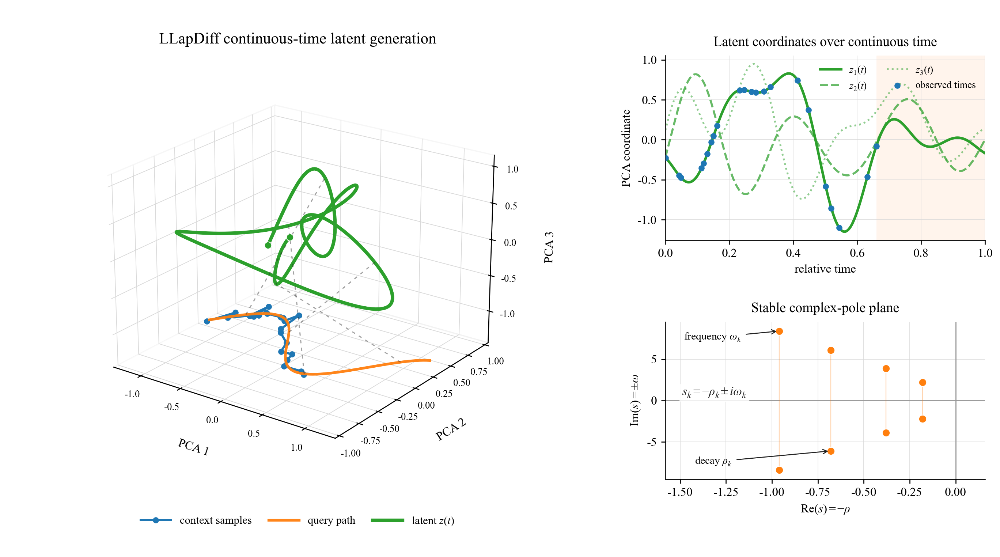
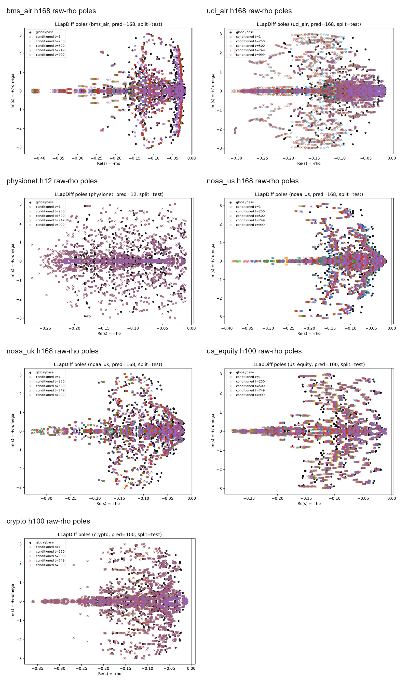

## Overview

This repo was folked from https://github.com/pixelhero98/LLapDiffusion

LLapDiffusion trains a timestamp-aware latent diffusion model for irregular multivariate forecasting and target-horizon imputation. The model conditions on observed values, timestamps, gaps, and masks, then denoises compact latent trajectories parameterized by stable Laplace-domain modes.



*Continuous-time latent generation with context samples, query path, latent coordinates, and stable complex poles.*


## Limitation

> Less effective when sampling is regular and no informative temporal (gap) missingness.
> 
> Realizations of the latent space and the history summarizer are just preliminary, which leaves room for improvement for follow-up works.
>
> Parameterized dynamics are locally linearized on the latent trajectory, where a natural follow-up is to derive richer nonlinear dynamics.

## Installation

Create a Python 3.11 environment and install the package:

```bash
python3.11 -m venv .venv
source .venv/bin/activate
python -m pip install --upgrade pip
python -m pip install -e .
```

If you need a specific CUDA build, install PyTorch from the official PyTorch selector before `python -m pip install -e .`.

Optional baseline dependencies:

```bash
python -m pip install -e ".[baselines]"
```

## Quick start
`Preset default checkpoints and raw datasets are available over HF`: Model: https://huggingface.co/pixelhero98/llapdiff-checkpoints, Dataset: https://huggingface.co/datasets/pixelhero98/llapdiff-raw

Run one public preset:

```bash
cd /path/to/LLapDiffusion
llapdiff-train \
  --dataset-key crypto \
  --summary-json ldt/results/crypto_pipeline_summary.json
```

Run one selected horizon and refresh cached model artifacts:

```bash
llapdiff-train \
  --dataset-key us_equity \
  --preds 100 \
  --recompute-vae \
  --recompute-summarizer \
  --summary-json ldt/results/us_equity_pred100.json
```

Public dataset keys:

```text
bms_air, uci_air, physionet, noaa_us, noaa_uk, us_equity, crypto
```

## Datasets and Cache

The package includes a compact evaluation cache archive at `llapdiffusion/datasets/LLapDiff-evaluation-datasets.zip`. The pipeline extracts it automatically when the expected cache directory is absent. To use a separate archive or extraction directory:

```bash
llapdiff-train \
  --dataset-key crypto \
  --dataset-zip /path/to/LLapDiff-evaluation-datasets.zip \
  --dataset-extract-dir /path/to/cache
```

The same settings can be provided with `LLAPDIFF_DATASET_ZIP` and `LLAPDIFF_DATASET_EXTRACT_DIR`. Extracted caches are written outside the installed package by default. The archive contains derived caches from public sources; each dataset remains governed by its original source terms.

`--coverage` means induced context missingness: the fraction of observed context entries to hide before modeling. Use `--coverage 0` for no induced missingness. Dense-date panel filtering, where supported by loader internals, is `panel_coverage` and separate from this setting.

## Main Commands

Prepare VAE and summarizer artifacts:

```bash
llapdiff-artifact-prep \
  --datasets bms_air uci_air physionet noaa_us noaa_uk us_equity crypto \
  --summary-json ldt/results/artifact_prep_summary.json
```

Train LLapDiff extrapolation checkpoints:

```bash
llapdiff-train --dataset-key crypto --preds 100
```

The default LLapDiff parameterization is velocity prediction (`v`). To train an x0 or epsilon-prediction checkpoint while keeping the dataset preset hyperparameters unchanged:

```bash
llapdiff-train --dataset-key crypto --preds 100 --predict-type x0
llapdiff-train --dataset-key crypto --preds 100 --predict-type eps
```

Non-default LLapDiff outputs and checkpoints are written under separate artifact directories such as `ldt/output/<dataset>/predict-x0/pred-<horizon>`, so they do not overwrite default v-prediction runs.

Evaluate a forecast checkpoint on raw forecast scale and LLapDiff target-horizon imputation:

```bash
llapdiff-checkpoint-eval \
  --dataset-key crypto \
  --pred 100 \
  --checkpoint /path/to/checkpoint.pt \
  --imputation-random-mask-ratio 0.30 \
  --out-json ldt/results/crypto_eval.json
```

This evaluates a forecast checkpoint by hiding observed target-horizon entries at evaluation time; `--imputation-random-mask-ratio 0.30` hides 30% of observed target-horizon entries.
Checkpoint evaluation infers the diffusion parameterization from checkpoint metadata. For legacy checkpoints without recorded metadata, pass `--predict-type v`, `--predict-type x0`, or `--predict-type eps` explicitly.

Optional target-mask auxiliary training mixes target-horizon completion batches into LLapDiff training:

```bash
llapdiff-train \
  --dataset-key crypto \
  --preds 100 \
  --target-mask-aux-p 0.30 \
  --target-mask-aux-keep-mode random \
  --target-mask-aux-keep-prob 0.50
```

The default `--target-mask-aux-p 0.0` is standard extrapolation training only. Use `--target-mask-aux-p > 0` to enable auxiliary completion batches; it is a training-time batch probability, not the same as evaluation-time `--imputation-random-mask-ratio`.

Plot learned poles:

```bash
llapdiff-plot-poles \
  --dataset-key crypto \
  --pred 100 \
  --checkpoint /path/to/checkpoint.pt \
  --output-dir ldt/results/pole_plot
```

Run synthetic regime-shift experiments:

```bash
llapdiff-synthetic-regime \
  --protocol-name boundary_crossing \
  --tasks synthetic_freq_shift synthetic_decay_shift \
  --seeds 3407 3408 3409 \
  --output-root ldt/results/synthetic_boundary_crossing
```

## Target Selection

Dataset presets define the public context lengths, horizons, latent sizes, split policy, and training defaults. Omit `--preds` to run all supported horizons for a dataset, or pass one or more supported horizons:

```bash
llapdiff-train --dataset-key noaa_us --preds 24 48 96 168
```

By default each cache uses its recorded target column metadata. To forecast selected feature columns already present in the cache, pass `--target-col` for one target or `--target-cols` for a multi-target LLapDiffusion run. DLinear/PatchTST baselines also support multi-target ablations:

```bash
llapdiff-train --dataset-key crypto --target-col RVOL20_CLOSE --preds 100
llapdiff-train --dataset-key crypto --target-cols RET_CLOSE RVOL20_CLOSE --preds 100
llapdiff-baselines practical-extrapolation --baseline dlinear --dataset crypto --target-cols RET_CLOSE RVOL20_CLOSE
```

Financial calendar features such as `DOW_*`, `DOM_*`, and `MOY_*` are context features only and cannot be selected as targets.

## Baselines

Baseline adapters are under `llapdiffusion.baselines`. DLinear, NeuralCDE, PatchTST, TimeGrad, mTAN, t-PatchGNN, ContiFormer, and CSDI require pinned upstream repositories cloned outside this repository; pass their parent directory with `--baseline-source-root` or set `LLAPDIFF_BASELINE_SOURCE_ROOT`. MR-Diff is implemented first-party from the paper and does not require an external source checkout.

Run practical extrapolation baselines:

```bash
llapdiff-baselines practical-extrapolation \
  --baseline all \
  --dataset all \
  --baseline-source-root /path/to/baseline-sources \
  --output-dir ldt/results/baseline_runs
```

Run CSDI target-horizon imputation:

```bash
llapdiff-baselines csdi-imputation \
  --dataset all \
  --baseline-source-root /path/to/baseline-sources \
  --imputation-random-mask-ratio 0.30 \
  --output-dir ldt/results/csdi_runs
```

The primary extrapolation comparison uses target-only baseline inputs. `--input-policy all_features` and multi-target `--target-cols` are available for DLinear/PatchTST ablations; other extrapolation adapters remain scalar target-only. CSDI is reported separately as target-horizon imputation, not as forecast extrapolation. Result metadata records `comparison_type`, `input_scope`, `missingness_scope`, `modeling_scope`, `split_note`, and `time_feature_protocol`. Baseline future time features use known query-grid metadata only; PhysioNet is marked as the patient-relative split special case.

## Citation

For now, cite the LLapDiffusion preprint: [https://arxiv.org/abs/2605.19805](https://arxiv.org/abs/2605.19805).

## License

This repository is released under the MIT License. See `LICENSE`.
